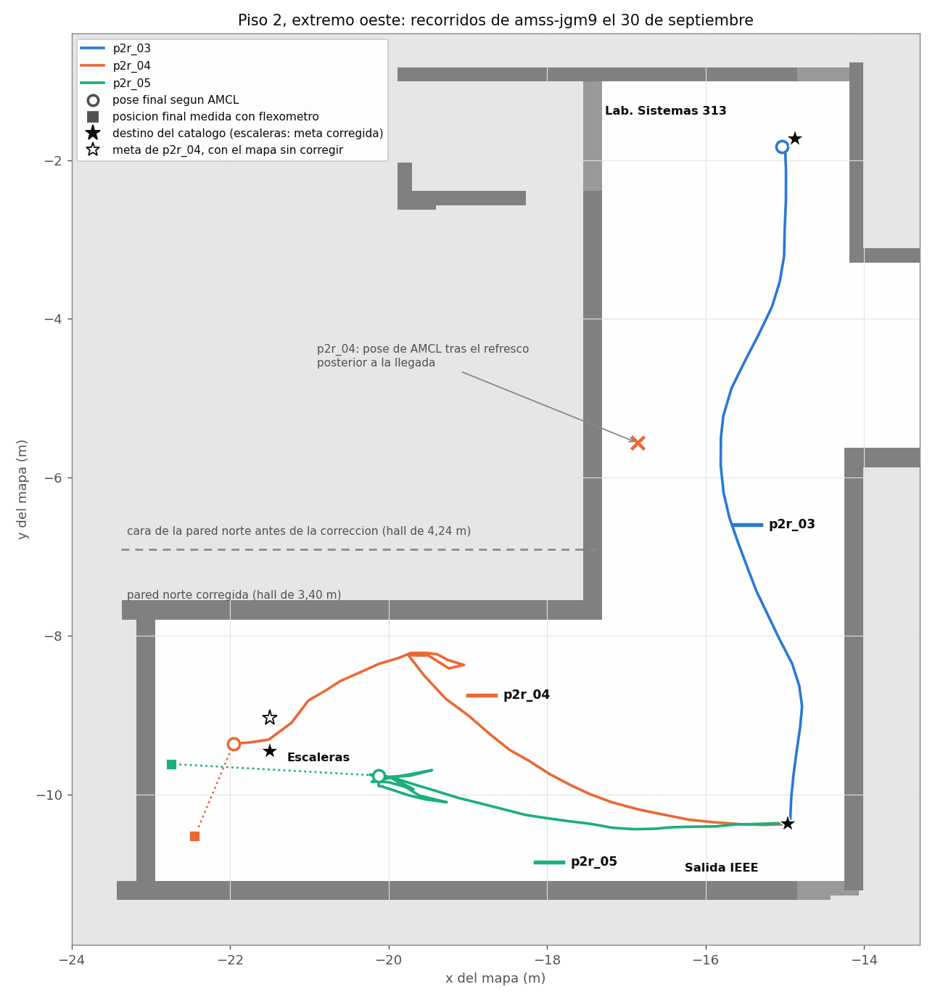

# Informe de avance de la semana 25

Universidad Santo Tomás · Facultad de Ingeniería Electrónica · Grupo de Estudio y Desarrollo en Robótica (GED)

Sistema colaborativo de robots móviles para asistencia de orientación en entornos interiores con múltiples pisos

Realizado por: Santiago Hernández Ávila y Jonny Alejandro Mejía León

Dirigido por: Ing. Armando Mateus Rojas, Msc.; Ing. Nestor Ivan Ospina, Msc.; Ing. Oscar Mauricio Gélvez Lizarazo, Msc.

Semana 25: 28 de septiembre al 4 de octubre de 2026, con corte el viernes 2. Fase 5: integración del sistema y realización de pruebas.

> Versión en Markdown para leer en el repositorio. La versión para compilar es
> [`Entregable_semana_25.tex`](Entregable_semana_25.tex), en Overleaf, donde está el logotipo de la
> portada.

---

## 1. Introducción

Este informe presenta el avance de la semana 25 del cronograma (28 de septiembre al 4 de octubre de
2026, con corte el viernes 2), dentro de la fase 5, integración del sistema y realización de pruebas.

La semana se dedicó a las compuertas G-2 y G-3, que el acta de la decisión GO/NO-GO exigía para el
primer corte, C-1, el viernes 2 de octubre. G-2 evalúa la odometría, la estimación del desplazamiento
del vehículo; G-3, la navegación de un vehículo con Nav2, el sistema de navegación de ROS 2. Las compuertas son
condiciones verificables, cada una con su fecha, que deben cumplirse para continuar con la
demostración física; los cortes son las fechas en que se revisan.

Los dos vehículos quedaron aislados entre sí y se probaron en tres sitios. En el hall del piso 2 el
modelo del edificio no correspondía a las medidas reales. El equipo levantó entonces con flexómetro
los pisos 3 y 4, que los directores y los evaluadores aprobaron como sitio nuevo el 2 de octubre. En el piso 4, la odometría cumplió el criterio de G-2 en las dos corridas medidas; la
llegada no cumplió el de G-3.

| Compuerta | Qué exige | Estado al 4 de octubre |
|---|---|---|
| G-1, actuación | El vehículo responde a las órdenes de dirección y tracción | Alcanzada el 22 de septiembre |
| G-4, coexistencia | Los dos vehículos y el coordinador (el programa que asigna las misiones y organiza el relevo) en la misma red, sin conflicto de nombres | Alcanzada el 22 de septiembre |
| G-2, odometría | Error de hasta 10 % sobre un recorrido medido de al menos 5 m | Criterio cumplido en las dos corridas medidas del piso 4 (+3,3 % y −4,6 %); falta declararla en el acta |
| G-3, navegación de un vehículo | Un recorrido de punto a punto con Nav2, con la llegada verificada | No alcanzada: llegadas a 0,57 m y 0,62 m, con tolerancia de 0,5 m |
| G-5, protocolo completo | Una misión (guiar a un usuario de un origen a un destino) con relevo entre los dos vehículos, uno en cada piso | Pendiente |
| G-6, RF-27 | Las repeticiones de RF-27 con el protocolo completo | Pendiente; requiere G-5 |

## 2. Objetivos de la semana

El cronograma fija para esta semana el siguiente criterio de cierre:

> *Corridas físicas registradas con la misma instrumentación que en simulación; video de la
> demostración listo.*

El criterio no se cumplió. El 25 de septiembre, al replanificar la semana contra las fechas del acta,
la campaña de RF-27 pasó a la semana 27, porque exige el protocolo completo con los dos vehículos
(G-5). La semana 25 quedó para las compuertas G-2 y G-3 y para montar el sistema en los vehículos
(`PLAN_S25.md`). De ese plan se cumplieron el aislamiento de los vehículos, las decisiones del
director y la configuración con espacios de nombres en el portátil; G-2 se midió y G-3 no se
alcanzó.

## 3. Decisiones del director

El 28 de septiembre, el director, Ing. Armando Mateus Rojas, resolvió los puntos siguientes, que
quedaron en la sección 6.1 del acta:

1. La demostración física se hace en los pasillos reales del edificio, los mismos que modela la
   simulación.
2. El número de repeticiones de RF-27 no se fija por adelantado; se elige con los resultados de las
   primeras corridas del sistema completo.
3. La tolerancia de llegada pasa de 0,25 m a 0,5 m en los vehículos reales. La campaña en simulación
   conserva 0,25 m.

## 4. Aislamiento de los dos vehículos

Con los dos vehículos encendidos, una orden de movimiento llegaba a los dos y la odometría de cada
uno recibía el LiDAR (el sensor láser que mide las distancias alrededor del vehículo) del otro. Los
tópicos del software del fabricante, que son los canales por los que se publican esos mensajes, no
llevan espacio de nombres. El 28 de septiembre se instaló en cada vehículo una partición de comunicaciones propia: una
configuración de la capa de comunicaciones de ROS 2 que hace que cada vehículo intercambie esos
mensajes solo con los procesos de su misma partición. Las cinco pruebas pasaron en los dos vehículos:

| Prueba | Resultado |
|---|---|
| La partición funciona en ROS 2 Jazzy, la versión de los vehículos | 9 de 9 comprobaciones en cada vehículo |
| El software del fabricante arranca con su partición | Sí, en los dos |
| El LiDAR solo se recibe con la partición | 6,97 Hz y 6,71 Hz con ella; ningún barrido sin ella |
| Una orden de dirección solo mueve su vehículo | Sí, en los dos |
| Con los dos encendidos, cada odometría recibe solo su LiDAR | 7,14 Hz y 6,70 Hz, frente a 14,68 Hz mezclados el 23 de septiembre |

El 29 de septiembre se encontró que la imagen de la cámara de cada vehículo también llegaba al otro
por la red inalámbrica, unos 1 MB/s en cada sentido, y se incluyó en la partición.

## 5. Ajustes de la navegación en el vehículo

Los ensayos del 29 y el 30 de septiembre dejaron varios ajustes propios del vehículo real. Están en
la configuración de Nav2 y en los programas que le dan los datos y mueven el vehículo. Los
principales son estos:

- La tarjeta de dos núcleos no sostiene el controlador a 20 Hz; se fijó en 10 Hz, y el plazo del
  gestor que vigila los programas de Nav2 pasó de 4 s a 20 s.
- El controlador de tracción no movía el vehículo con órdenes por debajo de 0,40 m/s. Desde el 29 de
  septiembre esas órdenes salen con el escalón más bajo que sí lo mueve.
- rf2o, el paquete que estima la odometría a partir de barridos consecutivos del LiDAR, leía la
  posición del sensor una sola vez al arrancar. Si en ese momento no estaba disponible, la odometría
  salía invertida, porque el LiDAR va montado a 180°. Se corrigió con una modificación de cuatro
  líneas al paquete, instalada en los dos vehículos.
- Nav2 da la meta por alcanzada a 1,0 m, y no a 0,25 m. Con 0,25 m el vehículo llegaba cerca de la
  meta y retrocedía buscándola, porque con dirección de tipo Ackermann no puede corregir en un
  espacio tan corto. Ese margen es el punto en que Nav2 deja de mover el vehículo; la llegada se
  sigue midiendo con flexómetro contra 0,5 m.

En una recta de 3,39 m medida con flexómetro, la odometría registró 3,458 m, un 2,0 % de más.

## 6. Pruebas en el hall del piso 2

El 30 de septiembre se hicieron las primeras pruebas en el edificio, en el hall del extremo oeste del
piso 2, con el vehículo `amss-jgm9` y el mapa que se genera del modelo de la simulación. Por el
alcance de la red inalámbrica, las rutas se limitaron a tres destinos: el IEEE, el Laboratorio de
Sistemas 313 y las escaleras.

Las medidas de una corrida mostraron que el hall mide 3,40 m de ancho y el modelo daba 4,24 m. Se
corrigió el modelo y se regeneró el mapa. Con el mapa corregido, AMCL (el método de localización
sobre el mapa, basado en un filtro de partículas) acertó de lado (0,15 m), pero a lo largo del hall
acumuló hasta 2,62 m de error. La odometría registró el 73 % del recorrido medido en las dos
corridas hacia las escaleras, y las dos llegadas quedaron a 1,43 m y 1,26 m del destino (Figura 1).
El vehículo terminó a 0,55 m y 0,25 m del borde de la escalera, así que se suspendió la navegación
hacia ella.

*Figura 1. Recorridos según AMCL en el hall del piso 2, sobre el mapa corregido, con la pose final de
AMCL y la posición medida con flexómetro. En las corridas hacia las escaleras, AMCL situó al vehículo
hasta 2,6 m antes de su posición real.*

## 7. Cambio de sitio a los pisos 3 y 4

El ancho del hall del piso 2 era la primera medida del modelo comprobada con flexómetro, y el modelo
lo daba un 25 % mayor que el real. Las demás medidas del modelo nunca se habían comprobado. Jonny Mejía levantó
con flexómetro los pasillos de los pisos 3 y 4 y generó de ese levantamiento el modelo de la
simulación y el mapa de navegación a la vez, de modo que los dos coinciden con el edificio. Al recorrer
cada piso por sus dos paredes, el levantamiento cierra con un error de 0,32 % en el piso 4 y de
0,62 % en el piso 3, dentro del 2 % que se fijó como criterio. Cada piso tiene cinco destinos: tres
salones, el ascensor y las escaleras.

El 2 de octubre los directores y los evaluadores aprobaron el cambio de sitio. Falta registrarlo en la
sección 6.1 del acta.

## 8. Pruebas en el piso 4

El 2 de octubre se hicieron cinco corridas en el piso 4 con los dos vehículos, cuatro de ellas desde
las escaleras hacia los salones. Dos se midieron con flexómetro:

| Corrida | Vehículo | Destino | Recorrido medido | Recorrido según la odometría | Error de la odometría | Distancia a la meta |
|---|---|---|---|---|---|---|
| p4r_03 | `amss-jgm9` | Salón 403 | 6,68 m | 6,370 m | −4,6 % | 0,62 m |
| p4d_01 | `amss-ez9n` | Salón 402 | 14,57 m | 15,045 m | +3,3 % | 0,57 m |

La odometría cumplió el criterio de G-2 en las dos corridas, y es la primera vez que lo hace en un
pasillo del edificio. La corrida p4d_01 es la medida más limpia: 14,57 m, con la salida medida desde
dos paredes y sin tocar el vehículo. En p4r_03 la salida no quedó exacta y el vehículo tuvo que ser
empujado para arrancar.

Las dos llegadas quedaron cortas, a 0,57 m y 0,62 m de la meta (Figura 2). Al detenerse, AMCL
situaba los vehículos a 0,96 m y 0,74 m de la meta, dentro del margen de 1,0 m en que Nav2 la da por
alcanzada. El error de AMCL frente a la posición medida fue de 0,42 m y 0,43 m, frente a los 2,62 m
del hall del piso 2.

*Figura 2. Corridas p4r_03 y p4d_01 en el piso 4: recorrido según AMCL, pose final de AMCL y posición
final medida con flexómetro. El tramo final de cada recorrido no quedó en la grabación.*

Las otras tres corridas no llegaron, por causas de operación y no del mapa:

- En la primera, Nav2 se desactivó porque la tarjeta del vehículo alcanzó una carga de 22 con la
  cámara y la fusión de sensores del fabricante encendidas, que el proyecto no usa. Al apagarlas, la
  carga bajó a 8,6 y Nav2 no volvió a desactivarse.
- En otra, Nav2 no obtuvo la posición del vehículo y abortó sin moverlo.
- La tercera intentó una media vuelta con Nav2 en un pasillo de 2,3 a 2,4 m de ancho y abortó: el
  planificador supone un radio de giro de 0,35 m, y el radio real del vehículo no se ha medido.

Con la misma escala de velocidad, `amss-jgm9` no arrancó sin ayuda y `amss-ez9n` llegó a 1,58 m/s.
La red inalámbrica dio retardos de hasta 850 ms y desconectó dos veces a `amss-ez9n`, y `amss-jgm9` se
quedó sin batería en mitad de la sesión.

## 9. Aporte a los objetivos específicos

| Actividad | Objetivo | Aporte |
|---|---|---|
| Aislamiento de los dos vehículos | OE2 | Por primera vez los dos vehículos pueden estar encendidos a la vez sin interferirse |
| Ajustes de la navegación en el vehículo | OE2 | Nav2 funciona en el vehículo con la carga real de la tarjeta y sin invertir la odometría |
| Pruebas en el hall del piso 2 | OE2, OE4 | Muestran que el modelo del piso 2 no correspondía al edificio y motivan el cambio de sitio |
| Levantamiento de los pisos 3 y 4 | OE2, OE4 | Sitio con modelo y mapa comprobados contra el edificio |
| Pruebas en el piso 4 | OE2 | Primera medida que cumple el criterio de G-2 en un pasillo del edificio |

| Objetivo | Avance | Aporte de la semana | Pendiente |
|---|---|---|---|
| OE1 | 100 % | — | — |
| OE2 | 79 % | Aislamiento, ajustes de la navegación y G-2 medido | Los dos vehículos navegando a la vez con espacio de nombres, y el coordinador en un vehículo |
| OE3 | 100 % | — | — |
| OE4 | 89 % | Sitio comprobado para la campaña física | RF-27, que requiere el protocolo completo |

Desde el 30 de septiembre el avance de cada objetivo es el promedio de sus requisitos. Cada requisito
cuenta según su estado: verificado, 100 %; verificado en simulación y con parte de la prueba física, 75 %; solo en
simulación, 50 %; con preparación sin prueba, 25 %. Con esa regla, el avance del objetivo 2 pasó de
65 % a 79 % y el del objetivo 4 de 85 % a 89 %, sin resultados nuevos: es un cambio de método. El
promedio de los cuatro objetivos es 92,0 %, frente al 78,1 % del calendario (semana 25 de 32). Lo
que falta es la parte física del sistema: el relevo entre los dos vehículos y la campaña de RF-27.

## 10. Estado del cronograma y trabajo previsto

| Parte del criterio de cierre | Estado | Evidencia |
|---|---|---|
| Corridas físicas registradas con la misma instrumentación que en simulación | No cumplida: la campaña de RF-27 se trasladó a la semana 27 el 25 de septiembre | `PLAN_S25.md` |
| Video de la demostración | No cumplida; se graba con la campaña | — |

El corte C-1 del 2 de octubre exigía G-2 y G-3. G-2 cumple su criterio en las dos corridas medidas
del piso 4, y G-3 no se alcanzó. El acta prevé que, si una de las dos no se alcanza en el corte, se
vuelve a NO-GO: RF-27 se declara no alcanzable y la evidencia queda en la campaña de simulación. Al
cierre de este informe, la declaración de las compuertas y el registro del cambio de sitio en el acta
están pendientes.

Para la semana 26 (5 al 9 de octubre) el equipo prevé:

1. Registrar en el acta el cambio de sitio y el estado de G-2 y G-3.
2. Comprobar si la tarjeta del vehículo incluye una unidad de medición inercial (IMU) con giroscopio. La
   documentación del fabricante indica un acelerómetro y un giroscopio integrados, y la comunidad del
   vehículo tiene un controlador para un sensor Bosch BMI160. Si está, se integrará para mejorar la
   estimación del rumbo, y con ella se podrá reducir el margen de llegada de Nav2, que hoy es de 1,0 m
   porque la navegación depende solo del LiDAR.
3. Desconectar las cámaras de los vehículos, que el proyecto no usa, para reducir la carga de la
   tarjeta, y ajustar la escala de velocidad de cada vehículo.
4. Repetir las corridas del piso 4 para cerrar G-2 y evaluar G-3.
5. Preparar la misión con relevo entre los pisos 3 y 4 (G-5): el coordinador en un vehículo, la red
   entre los dos pisos y el registro de la misión.

La campaña de RF-27 sigue prevista para la semana 27, con cierre de datos el 16 de octubre (corte
C-3), y la sustentación para la semana 28 o 29.

## 11. Conclusiones

1. Los dos vehículos pueden estar encendidos a la vez sin interferirse: cada uno recibe solo sus
   órdenes y su LiDAR.
2. El modelo del piso 2 no correspondía al edificio: el hall mide 3,40 m y el modelo daba 4,24 m. Los
   pisos 3 y 4, levantados con flexómetro, cierran con un error de 0,32 % y 0,62 %.
3. En el piso 4 la odometría cumplió el criterio de G-2 en las dos corridas medidas, con +3,3 % sobre
   14,57 m y −4,6 % sobre 6,68 m, frente al 73 % del recorrido que registró en el hall del piso 2.
4. G-3 no se alcanzó: las llegadas quedaron a 0,57 m y 0,62 m, cortas, porque Nav2 se detiene dentro
   de su margen de 1,0 m. El error de AMCL en la llegada fue de 0,42 m y 0,43 m.
5. Las fallas que impidieron más corridas fueron de operación: la carga de la tarjeta, la red
   inalámbrica, la batería y la escala de velocidad de cada vehículo.

## Anexo. Evidencia citada

| Documento | Qué respalda |
|---|---|
| `Documentos/ACTA_GO_NOGO.md` | Compuertas, cortes y sección 3 |
| `Documentos/PLAN_S25.md` | Secciones 2 y 10 |
| `Documentos/Evidencia/S25_aislamiento_dos_carros.md` | Sección 4 |
| `Documentos/Evidencia/S25_ensayo_laboratorio.md` | Secciones 4 y 5 |
| `Documentos/Evidencia/S25_pasillo_piso2_amss-jgm9.md` | Secciones 5 y 6 |
| `Documentos/GUIA_PISOS_3_Y_4.md` | Sección 7 |
| `Documentos/Evidencia/S25_pisos34_campo.md` | Sección 8 |
| `ESTADO.md` | Sección 9, avance por objetivo |
| `Documentos/CRONOGRAMA_S17_S32.md` | Sección 10 |
