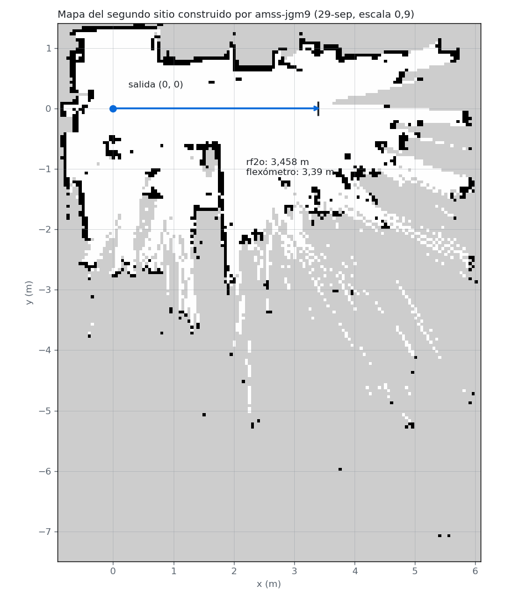
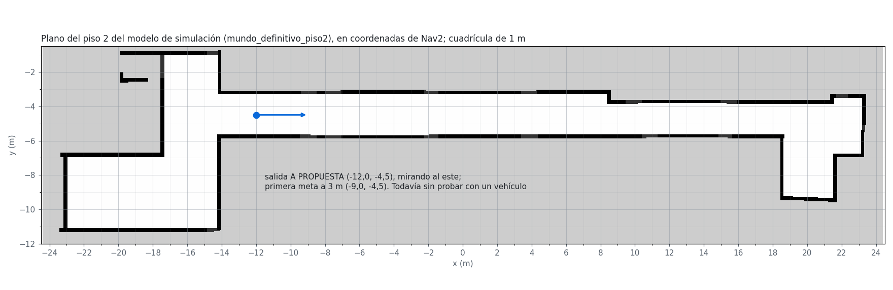

# Ensayo de B0 con `amss-jgm9` (29 de septiembre)

Registro del ensayo B0 de [`PLAN_S25.md`](../PLAN_S25.md), hecho antes de la sesión de compuertas
G-2 y G-3. Lo ejecutó Claude por SSH desde el portátil, a petición de Santiago; las observaciones del
movimiento y las medidas con flexómetro las hicieron Santiago y Jonny junto al vehículo.

Desde este día los vehículos tienen nombre: `racey` es `amss-jgm9` y `deepy` es `amss-ez9n`. Sus
direcciones quedaron reservadas en el router por MAC: `amss-ez9n` en la 192.168.0.102, `amss-jgm9`
en la 192.168.0.104 y el portátil en la 192.168.0.103.

## Resultado

| Prueba | Qué pedía el plan | Qué se hizo |
|---|---|---|
| L1 | Interferencia de la pila con las ruedas en el aire, los dos vehículos | Pendiente: `amss-ez9n` estaba sin batería de tracción (6,6 V, cargando) |
| L2 | Mapeo de 3 m con cada vehículo, con el otro encendido | Hecho con `amss-jgm9`, en dos sitios. Falta `amss-ez9n` |
| L3 | Nav2 sobre ese mapa, una corrida de 2 m | Hecho a medias con `amss-jgm9`: la cadena funciona y una meta de ocho llegó; AMCL no se localizó sobre el mapa de una sola pasada |

Del ensayo salieron los cambios de configuración y de código del §5, instalados en los dos
vehículos, y la decisión de probar más adelante Nav2 en el pasillo del piso 2 con el mapa
`mundo_definitivo_piso2`, que es el de la simulación (§3.3). Esa prueba no se ha hecho: los vehículos
todavía no han estado en los pasillos del modelo.

## 1. Tráfico de la cámara entre los vehículos

Con los dos vehículos encendidos, los pings a cada uno subieron de milisegundos a entre 1 y 2 s, con
hasta un 70 % de pérdida, mientras el portátil llegaba al router en 29 ms. Cada vehículo enviaba
cerca de 1 MB/s y recibía entre 0,7 y 0,9 MB/s. Un listado de los tópicos con publicador en un
vehículo y suscriptor en el otro mostró que el `sensor_fusion_node` de cada uno estaba suscrito a
`/camera_pkg/display_mjpeg/compressed` del otro. El proyecto no usa la cámara.

Los dos tópicos de imagen (`/camera_pkg/display_mjpeg` y `/camera_pkg/display_mjpeg/compressed`) se
añadieron a la partición de cada vehículo, que pasó de 10 a 14 entradas, y se reinició
`deepracer-core` en los dos. Los tópicos de servos, LiDAR y transformadas también aparecían en ese
listado, pero la partición impide que se emparejen, como comprobó A4.

Después del cambio la red siguió irregular a ratos. Se normalizó (pings de 5 a 20 ms) al terminar dos
grabadores que habían quedado colgados en `amss-jgm9` (§6); no se midió si esa fue la causa.

## 2. L2: mapeo conduciendo con `amss-jgm9`

`mapear_conduciendo.sh 3.0 0.5 20 <escala>`, con 3 m pedidos según rf2o, 0,5 m/s y tope de 20 s.

| Sitio | Escala | Parada | rf2o | Real | Tiempo | Mapa |
|---|---|---|---|---|---|---|
| Laboratorio | 0,68 | tope de tiempo | 0,335 m | sin confirmar | 30 s | `mapeo_155833`, 178 × 221 celdas |
| Laboratorio | 0,80 | obstáculo a 0,34 m | 0,013 m | solo sonó | 3,58 s | — |
| Laboratorio | 0,90 | distancia alcanzada | 2,917 m | más de 4 m, observado | 9,87 s | `mapeo_165409`, 185 × 138 celdas |
| Segundo sitio | 0,70 | obstáculo a 0,40 m | 0,675 m | no avanzó, observado | 14,89 s | — |
| Segundo sitio | 0,85 | obstáculo a 0,20 m (una persona se cruzó) | 0,385 m | avanzó muy lento | 2,47 s | — |
| Segundo sitio | 0,90 | distancia alcanzada | 3,458 m | 3,39 m con flexómetro | 5,60 s | `mapeo_193737`, 140 × 178 celdas |

Los mapas están en `~deepracer/` de `amss-jgm9`, a 0,05 m por celda.

- Con la escala de fábrica (0,68) y con 0,80, `amss-jgm9` no rompe la inercia; con 0,90 sí. La
  escala 0,9 es la que ya fija `nav2_mapa_guardado.sh`.
- En el laboratorio rf2o dio 2,917 m al ordenar la parada y 3,17 m al final de la grabación; los
  observadores vieron que el vehículo iba a pasar de los 4 m del tramo, así que rf2o se quedó corto.
  No hay medida con flexómetro de esa corrida. El rumbo registrado bajó de +2° a −45° en unos 3 m: el
  vehículo giró a la derecha con la dirección mandada en cero. Después se calibró el centro de la
  dirección.
- En el segundo sitio rf2o dio 3,458 m frente a 3,39 m de flexómetro, un 2,0 % de más. La velocidad
  media fue 0,617 m/s, frente a 0,296 m/s en el laboratorio con la misma escala.
- El registro de 0,70 dice 0,675 m de rf2o y los observadores no vieron avance. No se revisó la
  grabación de esa corrida.

## 3. L3: Nav2 con `amss-jgm9` sobre el mapa del segundo sitio

Nav2 se arrancó con `nav2_mapa_guardado.sh` sobre `mapeo_193737/mapa.yaml`, con la salida en (0, 0).
Las metas las mandó Santiago desde RViz en el portátil, con la herramienta «2D Goal Pose» (§4).

### 3.1 Desactivación de Nav2 en el primer arranque

Nav2 quedó activo y 35 s después el gestor del ciclo de vida (`lifecycle_manager_navigation`) dejó
de recibir el latido de `controller_server` durante 4 s y desactivó todos los nodos. La carga media
del vehículo era 18 con 2 núcleos. Al intentar reactivarlos a mano, `controller_server` no respondía
a sus servicios ni escribía en el log, y hubo que relanzar la cadena.

En ese relanzamiento se detuvieron en `amss-jgm9` la cámara y `sensor_fusion_node`, que el proyecto
no usa, hasta el siguiente reinicio de `deepracer-core`. Nav2 tardó entre 3 y 5 min en quedar activo
en cada arranque: configurar `planner_server` tomó 207 s la primera vez.

### 3.2 Corridas con RViz, antes y después de los arreglos

| | Antes de los arreglos | Después de los arreglos |
|---|---|---|
| Metas | 3; ninguna llegó | 8; llegó 1 |
| Esperas de recuperación | 9 | 18 |
| Retrocesos de recuperación | 7, todos fallidos por tiempo | 17: 10 completados, 7 fallidos |
| «Colisión por delante» del controlador | 12 | 40 |
| `Start occupied` del planificador | no se contó | 53 |
| Sin avance (`Failed to make progress`) | 0 | 11 |
| Frecuencia real del controlador, en los avisos de ritmo perdido | 3 avisos, media 5,2 Hz y mínima 1,0; objetivo 20 | 10 avisos, media 6,7 Hz y mínima 5,2; objetivo 10 |

Los arreglos fueron dos (§5): el puente sube a su escalón más bajo toda orden entre 0,01 y 0,40 m/s,
y el controlador pide 10 Hz. El árbol de comportamiento retrocede a 0,05 m/s, y con la banda muerta
anterior eso daba tracción cero; por eso ningún retroceso se movía antes y diez sí después.

La grabación de la segunda sesión (`nav2_l3_204111`) muestra la causa de los fallos restantes:

- La incertidumbre de AMCL (1σ en x e y) tuvo una mediana de 0,77 m y un máximo de 1,49 m, frente al
  criterio de 0,25 m. Entre poses consecutivas hubo 11 saltos de más de 0,3 m; el mayor, 1,73 m.
- En la primera meta, con el vehículo colocado en la salida, AMCL lo situaba en x = 3,30 m, que es el
  final del mapeo: confundía los dos extremos del tramo recorrido.
- Con una pose tan incierta, el planificador ubica al vehículo dentro de una pared del mapa y
  responde `Start occupied`.
- AMCL recibió los barridos: de unos 6 000 se descartaron 48, todos en los mapas de costos.
- En el 13 al 21 % de los barridos había retornos a menos de 0,25 m en los costados. Lo más probable
  es que fueran los pies de quien acompañaba al vehículo.

Es la inobservabilidad longitudinal ya medida en S22 y S23, ahora en el vehículo real. El mapa salió
de una sola pasada recta, con mucha zona sin observar, y a lo largo del recorrido el láser ve casi lo
mismo en todo el tramo.

### 3.3 Decisión pendiente de ejecutar: el mapa de la simulación en el pasillo real

Esta sección registra un plan, no una prueba. Todo lo anterior del §3 se hizo en el segundo sitio,
sobre el mapa que construyó `amss-jgm9`; ese mapa no tiene relación con el de la simulación, y los
vehículos todavía no han estado en los pasillos del modelo.

Santiago preguntó si se podían usar los mapas de la simulación. Se decidió probar Nav2 en el pasillo
del piso 2 con `mundo_definitivo_piso2`, generado de la geometría del mundo, que tiene las medidas
del edificio. En simulación, navegar con mapa conocido en esos pasillos dio 86,7 % de éxito en 30
misiones; lo que el pasillo no permite es construir el mapa conduciendo. El mapa ya está copiado en `~/tesis/`
de los dos vehículos. La salida propuesta es (−12,0, −4,5), mirando al este, 2 m al este de la
apertura al hall.

## 4. Portátil con Humble y vehículo con Jazzy

Se midió en los dos sentidos, con el perfil de partición de `amss-jgm9` cargado en el portátil:

| Sentido | Mensaje | Resultado |
|---|---|---|
| Vehículo → portátil | `sensor_msgs/LaserScan` | Se empareja y llega, pero no se decodifica: `sequence size exceeds remaining buffer` |
| Portátil → vehículo | `geometry_msgs/PoseStamped` | Llega completo (x = 1,25, y = −0,5) |

Por eso RViz en el portátil sirve para mandar metas a `/goal_pose` y poses a `/initialpose`, pero no
para ver el vehículo, el láser ni la ruta en vivo. El mapa se muestra desde una copia local, con un
`map_server` de Humble que publica en `/mapa_portatil` con otro nombre de nodo, para no chocar con el
`map_server` del vehículo. Ese sentido del portátil al vehículo es el que usa «2D Goal Pose»; la
acción `NavigateToPose` cambia entre Humble y Jazzy y no se usó.

## 5. Cambios instalados en los dos vehículos

| Archivo | Cambio | Por qué |
|---|---|---|
| `particion_amss-*.xml` | La cámara entra en la partición | §1 |
| `cmdvel_to_servo_pkg`: `constants.py`, `cmdvel_to_servo_node.py` | Toda orden de al menos 0,01 m/s sale con el escalón más bajo, y no con cero | §3.2 |
| `cmdvel_to_servo_pkg/test/prueba_mapeo_servo.py` | La sección 5 comprueba el comportamiento nuevo; 22 de 22 en el portátil y en `amss-jgm9` | — |
| `nav2_hardware.launch.py` | `controller_frequency` 10 Hz y `bond_timeout` del gestor 20 s | §3.1 y §3.2 |
| `mapear_conduciendo.sh` | El LiDAR se juzga por el mensaje recibido y no por el código de salida; la escala se reintenta y se confirma en el log del puente, comparando como número | Dos abortos falsos antes de mover el vehículo (§6) |
| `lanzar_bag.inc` | Si el grabador no cierra en 25 s, se termina | §6 |
| `extraer_mapa.py` | Lee un `.mcap` sin índice final, registro a registro | §6 |
| `nav2_mapa_guardado.sh` (corre en el portátil) | Busca `average rate` en las primeras líneas de `ros2 topic hz` | Abortó con el LiDAR a 9,9 Hz (§6) |

En `coordinacion_ws` del vehículo el puente está instalado con enlaces al código fuente, así que los
dos archivos se reemplazaron en `src/` y no hubo que compilar. Antes de reemplazarlos se comprobó que
los de los dos vehículos eran iguales a los del repositorio.

Tres archivos cambiaron solo en comentarios después de instalarlos: `mapear_conduciendo.sh`,
`avanzar_y_detener.py` y `nav2_hardware.launch.py`. Hay que copiarlos a los dos vehículos cuando se
enciendan.

## 6. Incidencias

1. `ros2 topic echo --once` recibía el barrido pero tardaba en cerrarse, el `timeout` lo cortaba y
   `mapear_conduciendo.sh` daba el LiDAR por muerto. Corregido (§5).
2. El servicio `/set_max_speed` recibía la petición, como consta en el log del puente, pero la
   respuesta no llegaba al cliente. Corregido confirmando en el log (§5).
3. Los grabadores de `ros2 bag record` no respondieron a la señal de cierre y dejaron el `.mcap` sin
   índice. El mapa se recuperó leyendo el archivo registro a registro (§5).
4. `nav2_mapa_guardado.sh` tomaba siempre la segunda línea de `ros2 topic hz`, y `average rate` sale
   en la primera o en la segunda según haya aviso previo. Corregido (§5).
5. Errores de Claude, sin consecuencias en el vehículo. Una copia con `cat >` dentro de un trabajo
   remoto en segundo plano dejó vacío el `mapear_conduciendo.sh` de `amss-ez9n`, que se repuso. Y
   `pkill -f` coincidió dos veces con la propia línea de órdenes y cortó la sesión SSH. El truco de
   `[r]` no protege si la misma orden contiene el nombre en otra parte; hay que separar el cierre del
   lanzamiento o usar `pkill -x`.

## 7. Pendiente

- L1 y el L2 de `amss-ez9n`, con los dos vehículos con batería de tracción.
- Nav2 con `mundo_definitivo_piso2` en el pasillo, salida (−12,0, −4,5): comprobar que la
  incertidumbre de AMCL baje de 0,25 m antes de cada meta.
- Bloque B (G-2 y G-3) esta noche, con `amss-jgm9` y escala 0,9, sobre
  [`S24_mapa_pasillo6m_HARDWARE`](S24_mapa_pasillo6m_HARDWARE.yaml), con las dos cajas colocadas
  según el §2 de la guía.
- Copiar a los dos vehículos los tres archivos que cambiaron en comentarios (§5).
