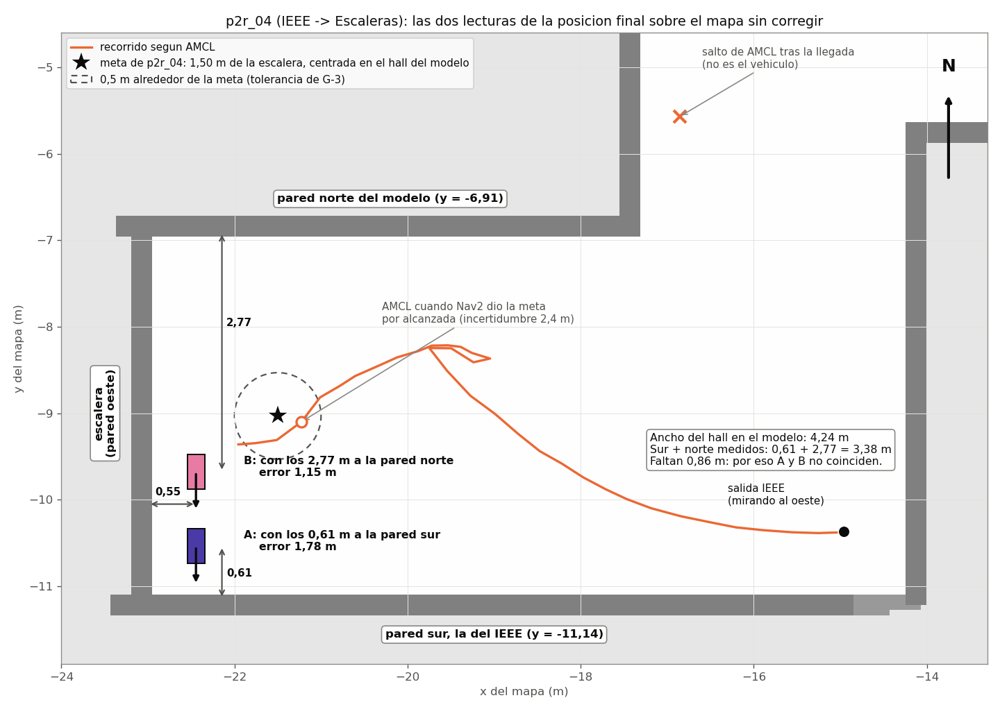
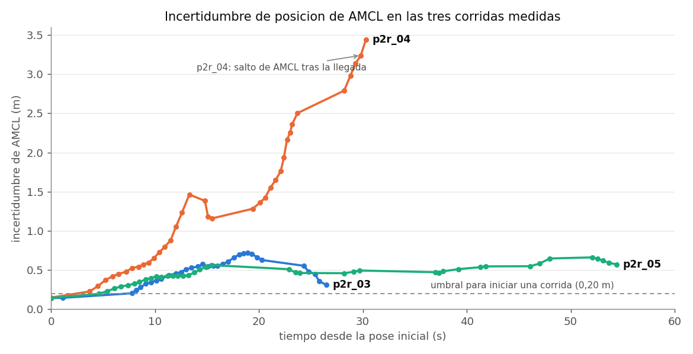

# Sesión de G-2 y G-3 con `amss-jgm9` en el piso 2 (30 de septiembre, noche)

Registro del bloque B-bis de [`PLAN_S25.md`](../PLAN_S25.md), en el extremo oeste del piso 2 del
edificio, sobre el mapa `mundo_definitivo_piso2`. Es la primera vez que un vehículo navega en los
pasillos que modela la simulación. El sitio lo confirmó el equipo antes de arrancar Nav2: el hall
del extremo oeste, con la puerta del IEEE en la pared sur, el pasillo hacia el Lab. Sistemas 313 al
norte y las escaleras en el extremo oeste. Claude ejecutó las corridas por SSH desde el portátil; el
equipo colocó el vehículo, cuidó el recorrido y midió con flexómetro. Las horas son las del
vehículo, en UTC; la hora local es cinco horas menos.

## Resultado

G-2 y G-3 siguen abiertas. De ocho corridas, dos tienen la llegada medida con flexómetro (p2r_04 y
p2r_05) y las dos quedaron fuera de la tolerancia de 0,5 m de G-3 (acta §6.1): 1,43 m y 1,26 m del
destino. En esas dos corridas la odometría de rf2o registró el 73 % del desplazamiento medido, un
error del 27 % frente al 10 % que exige G-2. Las dos iban hacia las escaleras, por el hall.

En la sesión se corrigieron:

1. La odometría invertida de rf2o, con un parche al paquete (§2).
2. El margen de llegada de Nav2, de 0,25 a 1,0 m (§3).
3. El ancho del hall en el modelo: mide 3,40 m y el modelo tenía 4,24 m (§5).

Con el mapa corregido, AMCL acierta de lado (0,15 m), pero a lo largo del hall acumula hasta 2,62 m
de error (§6). En p2r_04 y p2r_05 el vehículo terminó a 0,55 m y a 0,25 m del borde de la escalera,
y en p2r_08, según el equipo, también se fue hacia ella. Queda como regla no navegar hacia la
escalera hasta resolver la localización en el hall.

## 1. Preparación

- El router quedó en el IEEE y el portátil por cable al router. `amss-jgm9` perdía el WiFi al
  alejarse hacia las Aulas 311 y 302, así que el equipo limitó la prueba a tres destinos del
  catálogo: IEEE, Escaleras y Lab. Sistemas 313. El plan B-bis preveía un tramo de 5 m en el pasillo
  largo con `amss-ez9n`; se hizo con `amss-jgm9`, que es el vehículo del piso 2.
- Salida: una marca frente al centro de la puerta del IEEE, a 0,86 m de ella, que en el mapa es
  (−14,96, −10,37).
- `amss-ez9n` estuvo encendido al principio y se apagó sin correr. No recibió el parche de rf2o, el
  launch nuevo ni el mapa corregido.
- Escala del puente 0,9. Nav2 tardó de 3 a 5 min en quedar activo cada vez, y se lanzó tres veces.

## 2. Odometría invertida de rf2o: causa y parche

Al primer arranque de Nav2, rf2o registró `"base_link" passed to lookupTransform argument
target_frame does not exist` y siguió con `Laser odom [x,y,yaw]=[0.000000 0.000000 0.000000]`. Es el
mismo síntoma del 29-sep en los dos vehículos: Nav2 manda avanzar y `/odom` dice que el vehículo
retrocede. El retraso de 8 s del ajuste 7 no lo evitó: con la tarjeta cargada, el primer barrido
llegó 30 s después del arranque y la transformada `base_link → laser` seguía sin estar.

La causa está en el fuente. rf2o lee esa transformada una sola vez, con el primer barrido
(`setLaserPoseFromTf()`); si falla, no lo comprueba y sigue con una transformada vacía. El láser va
montado a 180°, así que con la transformada vacía todo el movimiento sale al revés.

Reiniciar rf2o a mano con la transformada ya publicada sirvió para p2r_01, y después rf2o se trabó
(564 ms por barrido y errores de extrapolación de la transformada): p2r_02 abortó porque AMCL no
convergía (incertidumbre de 1,28 m). El arreglo fue un parche de cuatro líneas: si la transformada
no está, rf2o descarta el barrido y lo reintenta con el siguiente
([`herramientas/parches/rf2o_esperar_tf_laser.patch`](../../herramientas/parches/rf2o_esperar_tf_laser.patch),
instalación en [`LEEME.md`](../../herramientas/parches/LEEME.md)). Se compiló en `amss-jgm9` a las
22:37. Al relanzar Nav2, la primera línea de rf2o fue `Laser odom [x,y,yaw]=[0.029130 0.000000
-3.141585]`: el láser a 2,9 cm del centro y girado 180°, que es su montaje.

## 3. Margen de llegada de Nav2 (ajuste 8)

En p2r_01 el vehículo llegó cerca de la meta y retrocedió buscando los 0,25 m del margen de llegada
de Nav2, porque un Ackermann no puede corregir en tan poco espacio. Nav2 terminó con `SUCCEEDED` a
los 48,4 s, tras 8 recuperaciones, con el vehículo a 0,374 m de la meta según AMCL. El equipo decidió subir el margen a 1 m. Se aplicó
en vivo a las 22:24 y quedó en `nav2_hardware.launch.py` como ajuste 8. Es el punto en que Nav2 deja
de mover el vehículo; el criterio de G-3 sigue siendo 0,5 m medidos con flexómetro.

## 4. Las corridas

`correr_corrida_nav2.sh` con escala 0,9; filas en `~deepracer/campana_p2_racey.csv` y grabación en
`~deepracer/campana_p2r_0N/` de `amss-jgm9`. El avance real sale de la marca de salida y de la
posición final medida con flexómetro contra las paredes.

| Corrida | Hora | Ruta | Resultado de Nav2 | Tiempo | Recuperaciones | Avance según rf2o | Avance real | Llegada medida |
|---|---|---|---|---|---|---|---|---|
| p2r_01 | 22:14 | IEEE → Lab. 313 | `SUCCEEDED` | 48,4 s | 8 | 8,080 m | no se midió | no |
| p2r_02 | 22:25 | IEEE → Lab. 313 | abortada antes de mandar la meta: AMCL sin converger | — | — | — | — | — |
| p2r_03 | 22:42 | IEEE → Lab. 313 | `SUCCEEDED` | 17,9 s | 0 | 7,887 m | no se midió | no |
| p2r_04 | 22:49 | IEEE → Escaleras | `SUCCEEDED` | 22,8 s | 0 | 5,467 m | 7,49 m | 1,43 m del destino |
| p2r_05 | 23:16 | IEEE → Escaleras | `ABORTED` | 45,6 s | 17 | 5,711 m | 7,82 m | 1,26 m del destino |
| p2r_06 | 23:26 | Lab. 313 → Escaleras | sin resultado: la herramienta no recibió la confirmación de la meta | — | — | — | — | — |
| p2r_07 | 23:34 | Lab. 313 → Escaleras | abortada antes de moverse: sin `/odom` | — | — | — | — | — |
| p2r_08 | 23:38 | Lab. 313 → Escaleras | `ABORTED` | 90,6 s | 17 | 5,154 m | no se midió | no |

- p2r_01 y p2r_03 recorren la misma ruta de 8,6 m. La primera se hizo con rf2o reiniciado a mano y
  margen de 0,25 m; la segunda, con el parche y el margen de 1 m. AMCL dejó p2r_03 a 0,191 m de la
  meta y el equipo vio que llegó, pero no se midió con flexómetro, así que no cuenta para G-3. En
  las dos, rf2o y AMCL difieren en 0,21 m y 0,65 m.
- p2r_04 se hizo con el mapa sin corregir. Medidas desde el centro del vehículo, que quedó mirando a
  la pared sur: 0,55 m al borde de la escalera, 0,61 m a la pared sur y 2,77 m a la norte. El
  destino del catálogo está a 1,50 m de la escalera y centrado en el hall, así que el vehículo se
  pasó 0,95 m y quedó 1,08 m al sur. Frente a la coordenada que se le dio con el mapa sin corregir,
  el error es de 1,77 m.
- p2r_05 se hizo con el mapa corregido. Medidas: 0,25 m al borde de la escalera, 1,52 m a la pared
  sur y 1,86 m a la norte. El vehículo se pasó 1,25 m del destino. El controlador frenó 14 veces por
  colisión por delante: el LiDAR veía la escalera a 1,3–1,6 m mientras AMCL la situaba a casi 4 m. Nav2 abortó cuando el planificador no encontró camino a una meta que, para el vehículo real,
  ya había quedado atrás.
- p2r_06, p2r_07 y p2r_08 salieron del Lab. 313, con el vehículo colocado a mano mirando al sur. La
  6 y la 7 terminaron sin mover el vehículo, por los fallos del §7. En p2r_08 la herramienta avisó
  que `/odom` se movió 0,399 m en los 2 s posteriores al final, y el equipo vio que el vehículo se
  iba hacia la escalera. Se publicó velocidad cero durante 3 s y la última orden al servo fue
  dirección 0 y acelerador 0. Su grabación está en el vehículo, sin analizar.

## 5. Corrección del ancho del hall

En p2r_04, las distancias a las paredes sur y norte sumaban 3,38 m, y el modelo daba 4,24 m entre
las caras de esas paredes. Sobre el mapa sin corregir, cada medida situaba al vehículo en un punto
distinto: A, con la medida a la pared sur, a 1,78 m de la meta, y B, con la medida a la pared norte,
a 1,15 m. En la sesión se dibujó con las caras de pared del mapa, a 6 cm por celda (1,77 m, 1,16 m y
0,82 m de diferencia); la figura se rehízo con las caras exactas del modelo.

El equipo midió el ancho del hall junto a la escalera: 3,40 m. Se corrigió el modelo
`mundo_definitivo_piso2/model.sdf`:

- `Wall_88`, la pared norte del hall, bajó 0,84 m (de y = −6,832 a −7,672);
- `Wall_85`, la pared oeste del pasillo del Lab. 313, se alargó 0,84 m para seguir cerrando la
  esquina, y `Barrera_Escalera` se acortó lo mismo.

El mapa se regeneró con la orden grabada en su `.yaml`. Las celdas libres pasaron de 40 760 a
39 444; la diferencia, 1316 celdas, corresponde a la franja de 0,84 m por 5,63 m que se quitó
(1312 celdas), así que el relleno no se escapó por ninguna esquina. El destino `piso2_escalera` del
catálogo pasa de y = −9,03 a −9,45, otra vez centrado en el hall. El mapa nuevo se cargó en el
`map_server` de `amss-jgm9` a las 23:14 con el servicio `load_map`, sin reiniciar Nav2, y el anterior
quedó en el vehículo como `mundo_definitivo_piso2.*.antes_2026-09-30`.

Comprobación: en el mapa corregido, la posición final de p2r_04 queda a 0,54 m, 0,60 m y 2,76 m de
las paredes oeste, sur y norte; con flexómetro se midieron 0,55 m, 0,61 m y 2,77 m. Solo esta pared
se comprobó con flexómetro; el resto del modelo no se midió en esta sesión.

El modelo y el catálogo son los mismos que usa la simulación, así que desde este cambio Gazebo
también tiene el hall de 3,40 m. La campaña de simulación se hizo con la geometría anterior, que
conserva la etiqueta `v0.4-implementacion-congelada`, y sus registros no se recomponen. La prueba de
`componer_registro.py` calcula la llegada contra el catálogo, y su caso sintético pasa a detenerse
en y = −9,45, a los mismos 0,19 m del destino.

## 6. Error longitudinal de AMCL en el hall

| | p2r_04 (mapa sin corregir) | p2r_05 (mapa corregido) |
|---|---|---|
| Avance según rf2o / avance real | 5,467 / 7,49 m (73 %) | 5,711 / 7,82 m (73 %) |
| Error final de AMCL, a lo largo del hall | 0,49 m | 2,62 m |
| Error final de AMCL, de lado | 1,17 m | 0,15 m |
| Incertidumbre máxima de AMCL | 3,44 m | 0,66 m |

La corrección del mapa quitó el error lateral y la incertidumbre de p2r_04, pero no el longitudinal:
en p2r_05, AMCL dejó al vehículo 2,6 m antes de donde estaba. En las dos corridas rf2o registró el
73 % del avance. Es consistente con lo medido en S23: los pasillos abiertos del piso 2 dan entre
5,1 % y 5,9 % de información de avance al láser
([`S23_informacion_avance_piso2.md`](S23_informacion_avance_piso2.md)).

AMCL tampoco lo corrigió con el láser, aunque la escalera estaba a la vista. El LiDAR del vehículo
barre 360°; el cono ciego de 60° del riesgo R13 es del sensor simulado. En p2r_05, a los 28 s, el
barrido muestra una línea de puntos atravesada en el hall a 1,3–1,6 m por delante, que con la pose
de AMCL cae en x ≈ −20,4, 2,6 m antes de la barrera del mapa. En la sesión se atribuyó esto al cono
ciego, y era incorrecto para el vehículo real.

Hipótesis para probar en el escritorio, reproduciendo las grabaciones con AMCL y otros parámetros:

1. rf2o pierde avance en el hall por la poca información longitudinal del lugar.
2. Los parámetros de AMCL vienen de la simulación: `max_beams` 60, `z_rand` 0,5, `update_min_d`
   0,25 m medidos con una odometría que se queda corta, y `recovery_alpha_slow` y
   `recovery_alpha_fast` en 0, sin reinyección de partículas. Cuando el error supera la dispersión
   de las partículas, las lecturas de la barrera ya no devuelven la pose.

En el pasillo del Lab. 313 (p2r_03), la incertidumbre subió a 0,72 m durante el recorrido y bajó a
0,31 m con el vehículo detenido, en los refrescos que pide la herramienta al final. En p2r_04, esos
mismos refrescos la subieron a 3,44 m y la pose saltó al pasillo del Lab. 313, a 7,5 m del
vehículo.
Por eso el informe de p2r_04 dio un error de llegada de 5,795 m que no corresponde a la llegada.

## 7. Incidencias

- p2r_06: `bt_navigator` registró `Failed to send goal response (timeout)` y `corrida_nav2.py`
  esperó la confirmación sin plazo. Se interrumpió con `kill -INT`; el vehículo no se había movido.
  Al interrumpirla, la herramienta no pudo publicar la velocidad cero (`publisher's context is
  invalid`): si el vehículo hubiera estado en marcha, la orden de parada no habría salido.
- p2r_07: el driver del LiDAR dejó de publicar a las 23:34:47 con el sensor girando, sin error en su
  registro ni desconexión USB. Volvió a las 23:38 al llamar a `/rplidar_ros/stop_motor` y luego a
  `/rplidar_ros/start_motor` (46 barridos en 6 s). La causa no se conoce.
- El informe de cada corrida imprime «tolerancia de Nav2: 0,25», que es un texto fijo; desde p2r_03
  el margen fue 1,0 m. «Avance pedido» y «error longitudinal según `/odom`» suponen una ruta recta y
  no valen para la ruta en L de p2r_08.
- rf2o publica la velocidad lineal con el signo invertido: −0,5 m/s con el vehículo avanzando, en
  p2r_04. La pose es correcta. Falta ver si Nav2 usa esa velocidad.
- El directorio temporal del portátil se vació durante la sesión y se perdieron las copias de las
  grabaciones de p2r_03 a p2r_05. Las originales siguen en el vehículo. Las trayectorias de AMCL de
  esas tres corridas se recuperaron de las tablas que se imprimieron desde las grabaciones durante
  la sesión: [`registros/S25_p2_amcl_corridas.csv`](registros/S25_p2_amcl_corridas.csv). Las
  figuras salen de ese archivo con `herramientas/figuras_s25_piso2.py`.
- Al apagar `amss-jgm9` se pierden los registros de Nav2 de `/tmp/nav2_campo/`.

## 8. Cambios de la sesión

| Archivo | Cambio | En `amss-jgm9` | En `amss-ez9n` |
|---|---|---|---|
| `rf2o_laser_odometry` (fuente del vehículo) | Parche: espera la transformada del láser | instalado y compilado (md5 `06cbdbe6c275`) | pendiente |
| `nav2_hardware.launch.py` | Ajuste 7 (rf2o 8 s después) y ajuste 8 (margen de llegada 1,0 m) | instalado; el repositorio añade después solo comentarios, falta recopiarlo | pendiente |
| `mundo_definitivo_piso2.yaml` y `.pgm` | Mapa con el hall de 3,40 m | instalado y cargado | pendiente |
| `puntos_interes.yaml` | `piso2_escalera` en y = −9,45 | no se usa en el vehículo | no se usa en el vehículo |
| `mundo_definitivo_piso2/model.sdf` | Hall de 3,40 m (`Wall_88`, `Wall_85`, `Barrera_Escalera`) | solo simulación | solo simulación |
| `prueba_nav2_hardware_ns.py` y `prueba_componer_registro.py` | Reconocen los ajustes 7 y 8; caso sintético en y = −9,45 | — | — |

## 9. Pendiente

1. Copiar de `amss-jgm9` las grabaciones de p2r_01 a p2r_08 y el CSV, y analizar p2r_08: por qué
   siguió hacia la escalera y qué hizo AMCL.
2. Nivelar `amss-ez9n` con los tres cambios del §8 y recopiar el launch a `amss-jgm9`.
3. Corregir `corrida_nav2.py`. Le falta un plazo para la confirmación de la meta y publicar la
   velocidad cero al interrumpirla. Además debe guardar la pose de AMCL de la llegada antes de
   refrescarla, quitar el texto fijo de la tolerancia y tratar las rutas que no son rectas.
4. Reproducir las grabaciones de p2r_04 y p2r_05 con AMCL en el portátil, con los parámetros del §6,
   y comparar contra las posiciones medidas.
5. Decidir con el equipo el sitio de la próxima sesión, que puede cambiar. El corte C-1 del acta es
   el viernes 2 de octubre.
