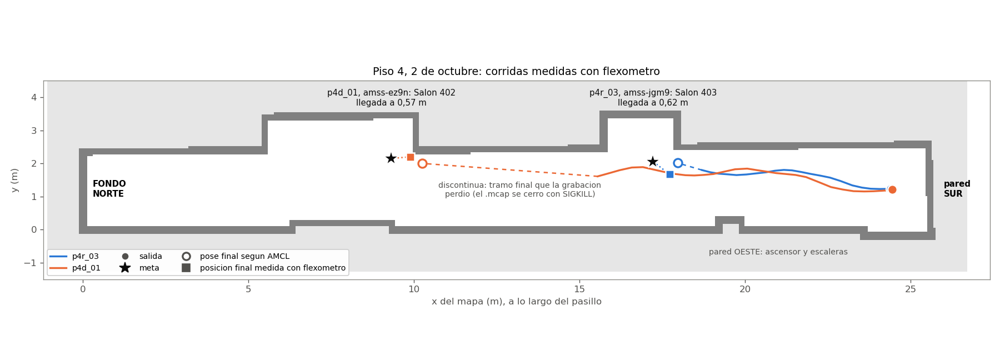

# Primera sesión en los pisos 3 y 4 (2 de octubre)

Primera sesión de navegación en el sitio nuevo: los pasillos de los pisos 3 y 4 del edificio,
levantados con flexómetro por Jonny ([`GUIA_PISOS_3_Y_4.md`](../GUIA_PISOS_3_Y_4.md), commits
`81d41f1` a `bd5d133`). Según el equipo, los directores y los evaluadores dieron el visto bueno al
cambio de sitio ese mismo día; falta registrarlo en el §6.1 de
[`ACTA_GO_NOGO.md`](../ACTA_GO_NOGO.md). Claude ejecutó las corridas por SSH desde el portátil; el
equipo colocó los vehículos y midió con flexómetro. Las horas son las del vehículo, en UTC; la hora
local es cinco horas menos.

## Resultado

Cinco corridas en el piso 4: tres con `amss-jgm9` (racey) y dos con `amss-ez9n` (deepy). Dos
llegaron y se midieron con flexómetro:

| Corrida | Vehículo | Ruta | Avance real | Avance según rf2o | Error de rf2o | Llegada medida |
|---|---|---|---|---|---|---|
| p4r_03 | `amss-jgm9` | Escaleras → Salón 403 | 6,68 m | 6,370 m | −4,6 % | 0,62 m de la meta |
| p4d_01 | `amss-ez9n` | Escaleras → Salón 402 | 14,57 m | 15,045 m | +3,3 % | 0,57 m de la meta |

- G-2 (odometría con error de 10 % o menos sobre 5 m o más) se cumple en las dos. p4d_01 es la
  medida más limpia: 14,57 m, salida medida desde las paredes y sin tocar el vehículo. En p4r_03 la
  salida no quedó exacta y el vehículo arrancó empujado. En el hall del piso 2, el 30 de septiembre,
  rf2o había registrado solo el 73 % del avance
  ([`S25_pasillo_piso2_amss-jgm9.md`](S25_pasillo_piso2_amss-jgm9.md)).
- G-3 (llegada a 0,5 m o menos) no se cumple: 0,57 m y 0,62 m. Las dos llegadas quedaron cortas,
  porque Nav2 da la meta por alcanzada a 1,0 m desde el 30 de septiembre (ajuste 8): al detenerse,
  AMCL situaba a los vehículos a 0,96 m y 0,74 m de la meta. Con ese margen, la llegada dentro de
  0,5 m depende de cuánto se acerque el vehículo antes de cruzarlo.
- La media vuelta con Nav2 (p4d_02) no fue posible en un pasillo de 2,3 a 2,4 m (§4).

## 1. Preparación

- Los dos vehículos recibieron los mapas `piso3` y `piso4` y el `nav2_hardware.launch.py` del
  repositorio, con el md5 igual al repositorio. `amss-ez9n` recibió además el parche de rf2o
  (fuente `06cbdbe6c275`, compilado a las 22:25); `amss-jgm9` lo tenía desde el 30 de septiembre.
- Salida: frente a las escaleras, centrada en el pasillo y mirando al norte (yaw π). En el piso 4,
  la de p4r_03 fue (24,39, 1,23). Para p4d_01 se pasó a (24,45, 1,21), que se coloca midiendo desde
  dos paredes: el centro del vehículo a 1,00 m de la pared sur y a 1,25 m de la pared este.
- `nav2_mapa_guardado.sh` publicaba la pose inicial siempre con rumbo 0. Se añadió `POSE_YAW`, para
  que AMCL arranque con el rumbo de la salida.
- En la ruta de cada meta se comprobó primero `compute_path_to_pose` sin mover el vehículo:
  `SUCCEEDED` hacia los salones 403, 402 y 401, incluido el tramo de 2,16 m del piso 4.
- `amss-ez9n`, previsto para el piso 3, se cayó de la red dos veces y se reinició; no corrió en el
  piso 3. Cuando `amss-jgm9` se quedó sin batería tras p4r_03, `amss-ez9n` pasó al piso 4.

## 2. Corridas con `amss-jgm9` (piso 4)

| Corrida | Hora | Resultado | Causa |
|---|---|---|---|
| p4r_01 | 22:47 | sin resultado; la herramienta esperó 10 min y se interrumpió | Nav2 se desactivó a las 22:48:55: el gestor del ciclo de vida no recibió el latido de `bt_navigator` en 20 s, con la carga media de la tarjeta en 22 |
| p4r_02 | 23:09 | `ABORTED` en 1,0 s, sin mover el vehículo | `bt_navigator`: «Initial robot pose is not available»; la causa probable son transformadas atrasadas justo después de reiniciar AMCL con la pose inicial |
| p4r_03 | 23:12 | `SUCCEEDED` en 34,2 s, 3 recuperaciones | llegada medida (§5) |

Entre p4r_01 y p4r_02 se detuvieron la cámara (`camera_node`) y `sensor_fusion_node`, que el
proyecto no usa, y se relanzó Nav2: la carga bajó de 22 a 8,6 y Nav2 no volvió a caerse. El
LiDAR quedó a 5,75 Hz, frente a 7,1 Hz al arrancar. En p4r_03, con la escala del puente en 0,9, el
vehículo no rompió la inercia: pasaron 4,1 s entre la primera orden de avance y el primer
movimiento, y el equipo lo empujó. El WiFi de `amss-jgm9` dio entre 60 y 850 ms de latencia en el
piso 4.

## 3. Corrida p4d_01 con `amss-ez9n` (piso 4)

`SUCCEEDED` en 14,2 s, sin recuperaciones, con la escala en 0,9. El vehículo arrancó 0,4 s después
de la primera orden y, en el tramo grabado, rf2o registró hasta 1,58 m/s. Medidas desde el centro del
vehículo: 14,57 m de avance desde la salida y 2,2 m a la pared oeste. El equipo anotó además que
quedó a unos 45 cm de la pared este, justo antes del nicho del Salón 402. Por lo rápido que fue, el
equipo pidió bajar la escala, que pasó a 0,85.

## 4. Media vuelta con Nav2 (p4d_02)

Desde la llegada de p4d_01, mirando al norte, a la salida frente a las escaleras: el planificador
encontró la maniobra (`SUCCEEDED`), pero Nav2 abortó a los 21,2 s tras 18 recuperaciones, con el
vehículo 0,6 m más adelante. El controlador detectó colisión por delante 15 veces al empezar el giro,
y los dos retrocesos se cancelaron por colisión detrás. El planificador supone un radio de giro de
0,35 m (`minimum_turning_radius`), y el radio real del vehículo no se ha medido. A pedido del equipo
se detuvo el vehículo con velocidad cero durante 3 s.

## 5. Análisis de las llegadas

| | p4r_03 | p4d_01 |
|---|---|---|
| Posición medida (x, y) | (17,71, 1,68) | (9,88, 2,20) |
| Meta (x, y) | (17,22, 2,06) | (9,31, 2,15) |
| Corto a lo largo del pasillo / de lado | 0,49 m / 0,38 m | 0,57 m / 0,05 m |
| Pose final de AMCL y su error frente a lo medido | (17,963, 2,015); 0,42 m | (10,256, 2,001); 0,43 m |
| Distancia a la meta según AMCL al detenerse | 0,74 m | 0,96 m |

Las trayectorias de AMCL están en
[`registros/S25_p4_amcl_corridas.csv`](registros/S25_p4_amcl_corridas.csv) y la figura sale de
`herramientas/figuras_s25_pisos34.py`.

## 6. Conclusiones

1. En el piso 4, rf2o registró el avance con un error de +3,3 % sobre 14,57 m y de −4,6 % sobre
   6,68 m, dentro del 10 % de G-2. Es la primera vez que la odometría del vehículo cumple ese criterio
   en un pasillo del edificio.
2. Ninguna llegada cumple G-3. Las dos se quedaron cortas por el margen de llegada de 1,0 m de Nav2,
   con un error de AMCL de 0,42 y 0,43 m en la llegada. Para que G-3 sea alcanzable, el margen tiene
   que ser de 0,5 m o menos; con 0,25 m el vehículo retrocedía buscando la meta (p2r_01, 30 de
   septiembre). La decisión es del equipo.
3. Una misma escala del puente no sirve para los dos vehículos: con 0,9, `amss-jgm9` no arrancó sin
   empujarlo y `amss-ez9n` llegó a 1,58 m/s. Hace falta una escala por vehículo, que es la
   calibración pendiente de RF-14.
4. La media vuelta con Nav2 no es viable en estos pasillos con la configuración actual. Antes de
   volver a intentarla hay que medir el radio de giro real y ponerlo en el planificador.
5. Con la cámara y la fusión de sensores encendidas, la tarjeta no sostiene Nav2: carga de 22 y Nav2
   desactivado. Hay que apagarlas antes de arrancar Nav2.

## 7. Incidencias

- Las grabaciones de p4r_03 y p4d_01 se cortan antes del final de la corrida (en x = 18,70 y
  x = 15,55): el guion cierra el grabador con `SIGKILL` y se pierde el último bloque del `.mcap`. Las
  filas del CSV de la campaña, que escribe la herramienta, están completas.
- `corrida_nav2.py` esperó 10 min a Nav2 en p4r_01, sin plazo; sigue pendiente su corrección
  ([`S25_pasillo_piso2_amss-jgm9.md`](S25_pasillo_piso2_amss-jgm9.md) §9).
- Se corrigió la guía de los pisos 3 y 4. Las rutas del vehículo siguen ahora la convención del
  repositorio y el arranque exige la salida, que sin ella cae sobre la pared oeste. La prueba del
  plan carga el perfil de la partición, y el §5.2 está al día con el margen de 1,0 m.

## 8. Pendiente

1. Copiar las grabaciones de p4r_01, p4r_02 (en `amss-jgm9`) y p4d_02 (en `amss-ez9n`). Las de
   p4r_03 y p4d_01, sus registros y los dos CSV están en el portátil, en
   `~/tesis_evidencia/campo_2026-10-02/`.
2. Registrar en el §6.1 del acta el cambio de sitio a los pisos 3 y 4, y declarar G-2 y G-3 con las
   cifras de esta sesión.
3. Decidir el margen de llegada de Nav2 para G-3 (conclusión 2).
4. Escala del puente por vehículo, radio de giro real y apagar la cámara y la fusión en el arranque.
5. Corregir `corrida_nav2.py` y el cierre del grabador.
6. Probar `amss-ez9n` en el piso 3.
